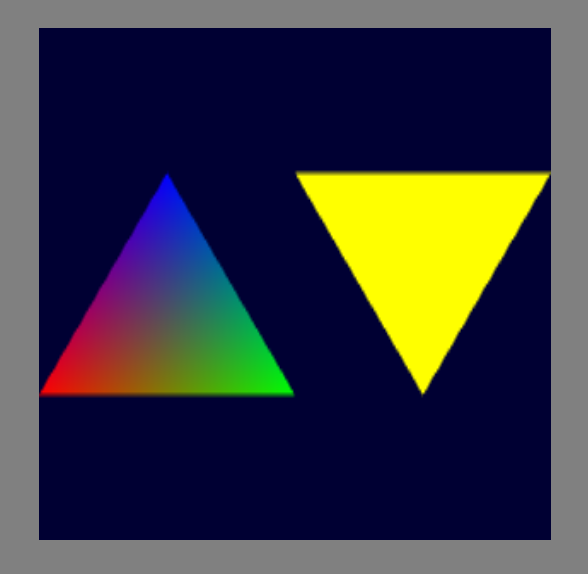

# Setup and Installation
> REF: [WebGL2Fundamentals - WebGL2 Setup and Installation](https://webgl2fundamentals.org/webgl/lessons/webgl-setup-and-installation.html)

You can learn WebGL on a [online compiler](#online-compiler) or setup a [local environment](#local-environment) to try and test. If you just want to quickly explore what WebGL can do, or simply test some features, you may consider using an online compiler. If you are planning to learn more on web application, or you are intended to build a website, local environment setup is recommended.
## Online compiler
If you do not wish to setup your local environment for running your program, an alternative is to use a online platform to do the rendering for you.

- [jsfiddle.net](https://jsfiddle.net/greggman/8djzyjL3/)
- [codepen.io](https://codepen.io/greggman/pen/YGQjVV)
- [jsbin.com](https://jsbin.com/?html,output)

## Local Environment
If you plan to set up a local environment, a web server is needed for us to host our webpage. There are many ways to host a webpage locally. 

In our guide, [Node.js](https://nodejs.org/) is used because it is a widely adopted runtime environment for web application. It supports on Windows, macOS and most of the linux operating system.

A simple solution to set up a web server with Node.js suggested by WebGL2Fundamentals is to use [Servez](https://greggman.github.io/servez/).  

*In our guide, we build the web server using [Express.js](https://expressjs.com/) instead of using Servez.

### Installation of Node.js
Check Node.js is installed.
```
node -v
```
If an error is shown, mentioning 'node' is not recognized, you need to install Node.js first. Installation guide is not provided. You may check the following guide from Node.js official website.
[Node.js - How to install Node.js](https://nodejs.org/en/learn/getting-started/how-to-install-nodejs)

### Setting up Express.js
1.  Initalise a npm project on your directory
    ```
    npm init
    ```
    _keep presssing `Enter` to use default configurisation._
    <br/>
2.  Install Express
    ```
    npm install express
    ```
    <br/>
### Creating the content
> REF: https://github.com/sessamekesh/webgl-tutorials-2023/tree/main/src/01-hello-triangle

1.  Create a public folder
    ```
    mkdir public
    ```
    <br/>
2.  Create HTML, CSS, JS file
    > NOTE: you can create the file in other way, like `new file` in VS Code
    ```
    touch public/index.html
    touch public/styles.css
    touch public/main.js
    ```
    Please check the example code [here](/res/01_SetupAndInstallation/).
    For main.js, there plenty of codes and you may get suprised xD.
    No worry, we will discuss it in the next part
    <br/>
3.  Create a server JS file
    > NOTE: you can create the file in other way, like `new file` in VS Code
    ```
    touch server.js
    ```
    Please check the example code [here](/res/01_SetupAndInstallation/)
    <br/>
### Start and Close the Server
- Start the Server
    ```
    node server.js
    ```
    View the website on [http://localhost:3000/](http://localhost:3000/)
    Two triangles on a navy blue canvas should appear.
    
    <br/>
- Close the Server  
    Press `ctrl+c` to exit process.
